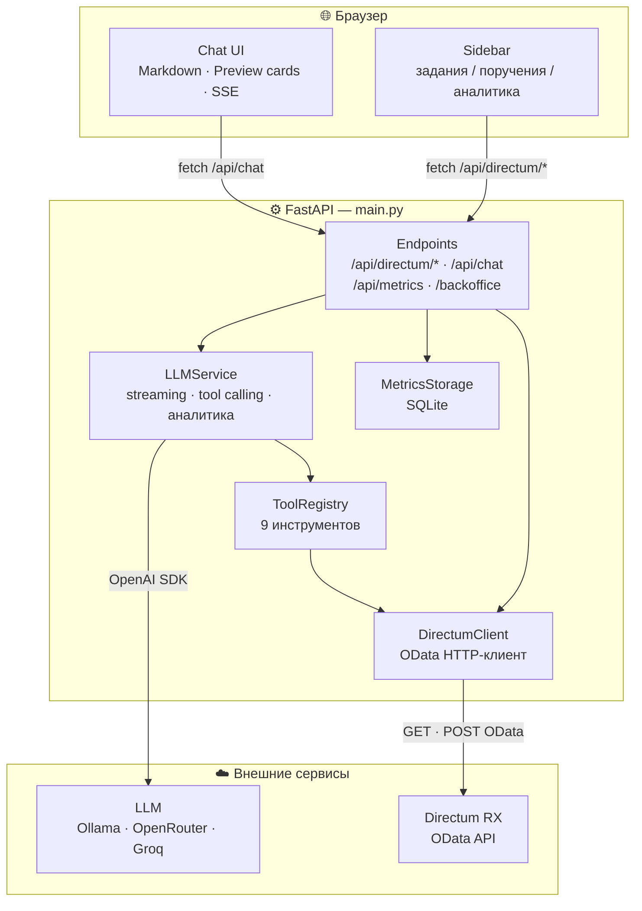

# MCP Directum RX Assistant

Прототип чат-интерфейса для работы с заданиями и поручениями Directum RX через LLM с MCP-стильными инструментами.

## Статус проекта

**Работает:**
- Просмотр заданий, просроченных заданий, поручений (входящих и исходящих)
- Поиск сотрудников и документов (с fuzzy-fallback по токенам)
- Preview-карточки с подтверждением перед созданием
- Рендеринг Markdown в чате
- Аналитика исходящих поручений по категориям (в работе / срок подходит / просроченные)
- Кликабельные ссылки на карточки Directum в результатах
- Автокоррекция текста поручения через LLM (повелительное наклонение, отглагольная тема)
- Контекстный диалог: разрешение местоимений («для неё», «ей»), повтор предыдущего исполнителя
- Создание через свободный текст с LLM-извлечением параметров

**Требует проверки:**
- Создание поручений и задач в Directum — endpoint сменён на `RecordManagement/CreateActionItemExecution` и `Docflow/CreateSimpleTask`, но результат не верифицирован на реальной инсталляции Directum RX

**Не реализовано:**
- Прикрепление документа к поручению через UI (требует `document_id`)
- Управление наблюдателями и соисполнителями
- Отзыв/завершение поручений и задач через чат

## Возможности

### Чат с LLM
- Отправка сообщений на русском языке в чат
- Ответы LLM с рендерингом Markdown (жирный, курсив, заголовки, списки, код, блок-цитаты, ссылки)
- Потоковая передача ответов (StreamingResponse)
- Быстрые команды без обращения к LLM: «мои задания», «просроченные», «назначенные мне», «созданные мной»
- Аналитика исходящих поручений по категориям (в работе / срок подходит / просроченные) — фраза «аналитика исходящих поручений»
- Контекстный диалог: местоимения («для неё», «ей»), повтор исполнителя и текста из предыдущего сообщения

### Preview карточки
- Перед созданием поручения/задачи отображается preview-карточка
- Кнопки **«Создать поручение»** (или **«Создать задачу»**) и **«Отмена»**
- Создание происходит только после нажатия кнопки подтверждения
- Логика: `confirm=false` → preview, `confirm=true` → POST в Directum

### Панель Directum (боковая)
- **Мои задания** — активные задания текущего пользователя
- **Просроченные** — просроченные задания
- **Поручения мне** — поручения где я исполнитель
- **Поручения от меня** — поручения где я автор
- **Создать поручение** — подсказка в чате

### Поиск сотрудников и документов
- `search_employee` — поиск по IEmployees (автоматически пробует сокращённые токены)
- `search_documents` — поиск по IOfficialDocuments с fuzzy-fallback, стемминг суффиксов, расшифровка аббревиатур (МЦ → Минцифр)

### Backoffice (метрики)
- Статистика чата: запросы, preview/confirmed, ошибки
- Последние вызовы инструментов
- Настройка LLM-провайдера и Directum прямо в интерфейсе

## Архитектура



## Конфигурация

### Переменные окружения (.env)

```env
# LLM (Ollama — локальный)
LLM_PROVIDER=ollama
OPENAI_BASE_URL=http://localhost:11434/v1
OPENAI_API_KEY=ollama
OPENAI_MODEL=llama3.1:latest
LLM_TOOL_CALLING=auto

# Если Ollama на Windows-хосте, а приложение в Docker:
OPENAI_BASE_URL=http://host.docker.internal:11434/v1

# Directum RX
DIRECTUM_BASE_URL=https://your-directum/Integration/odata
DIRECTUM_AUTH_TOKEN=Basic base64_username_password

# Опционально: OpenRouter (вместо Ollama)
# LLM_PROVIDER=openrouter
# OPENAI_BASE_URL=https://openrouter.ai/api/v1
# OPENAI_API_KEY=sk-or-v1-your-key
# OPENAI_MODEL=google/gemma-4-26b-a4b-it:free

APP_HOST=0.0.0.0
APP_PORT=8000
METRICS_DB_PATH=data/metrics.db
```

### Запуск локально (без Docker)

```powershell
cd "c:\Users\Администратор\Desktop\Работа\ПРототипы\MCP Directum RX"
copy .env.example .env
# отредактируй .env с реальными значениями
uv run uvicorn src.main:app --reload --port 8005
```

Открыть: http://localhost:8005/

### Запуск в Docker

```powershell
docker-compose build
docker-compose up -d
```

Открыть:

- UI: http://localhost:8000/
- Backoffice: http://localhost:8000/backoffice

## API Endpoints

| Method | Path | Описание |
|--------|------|----------|
| GET | `/` | Главная страница (чат) |
| GET | `/backoffice` | Страница метрик и настроек |
| GET | `/health` | Статус приложения и LLM |
| POST | `/api/chat` | LLM чат (StreamingResponse) |
| GET | `/api/directum/assignments/my` | Мои задания |
| GET | `/api/directum/assignments/overdue` | Просроченные задания |
| GET | `/api/directum/action-items/assigned-to-me` | Поручения мне |
| GET | `/api/directum/action-items/created-by-me` | Поручения от меня |
| GET | `/api/directum/employees/search?query=` | Поиск сотрудника |
| GET | `/api/directum/documents/search?query=` | Поиск документа |
| POST | `/api/directum/action-items` | Preview (`confirm=false`) или создание (`confirm=true`) поручения |
| POST | `/api/directum/tasks` | Создание задачи (без документа) |
| GET | `/api/metrics` | Метрики (backoffice) |

## Поток создания поручения

```
1. Пользователь в чате: "создай поручение для Наташи Ардо, тема Подготовка документов"
   ↓
2. LLMService._direct_action_item_create_response() парсит сообщение
   ├─ Regex-парсинг (quoted / natural / theme / performer-only форматы)
   └─ Fallback: LLM-извлечение параметров (_extract_create_draft_via_llm)
   ↓
3. search_employee("Наташа Ардо") → найден сотрудник (id=42)
   ↓
4. create_action_item(subject, performer_id=42, action_text) → preview
   ↓
5. LLM корректирует текст: повелительное наклонение, отглагольная тема
   ↓
6. В чат возвращается: текст + [[DIRECTUM_ACTION_ITEM_PREVIEW:{...}]]
   ↓
7. app.js парсит маркер, рендерит preview-карточку с кнопками
   ↓
8. Пользователь нажимает "Создать поручение"
   ↓
9. POST /api/directum/action-items {"confirm": true, ...}
   ↓
10. ActionItemService.create_action_item() → POST RecordManagement/CreateActionItemExecution
    → POST Docflow/StartTask (автостарт)
```

## Известные проблемы

### Создание поручений/задач — требует проверки

Endpoint сменён с `RecordManagement/CreateActionItemExecutionTask` на `RecordManagement/CreateActionItemExecution`.
Автостарт через `Docflow/StartTask` добавлен. Результат на реальной инсталляции Directum RX **не верифицирован**.

Если снова появится 400 `Не указан обязательный параметр "Кем"` — причина: API требует автора (`AssignedBy`) через OData navigation property `$ref`. Подробный анализ в `handoff.md`.

### LLM Tool Calling

- **Ollama gemma4**: не генерирует tool calls, отвечает текстом → переключено на llama3.1:latest
- **Groq LLaMA 3.3**: есть баг с кириллицей в аргументах tool call (кракозябры вместо русского)

## Структура файлов

```
MCP Directum RX/
├── src/
│   ├── main.py                    # FastAPI app, все endpoints
│   ├── config.py                  # Settings (pydantic)
│   ├── models/
│   │   └── schemas.py            # Pydantic модели запросов
│   ├── services/
│   │   ├── llm_service.py         # LLM integration, tool calling, preview markers
│   │   ├── tool_registry.py       # 9 инструментов для LLM
│   │   ├── directum_client.py     # OData HTTP клиент
│   │   ├── action_items.py        # Создание поручений/задач
│   │   ├── assignments.py         # Получение заданий
│   │   ├── current_user.py        # Текущий пользователь Directum
│   │   └── metrics_storage.py    # SQLite метрики
│   └── static/
│       ├── index.html            # Главная страница (marked.js)
│       ├── backoffice.html       # Метрики и настройки
│       ├── backoffice.js
│       ├── app.js                 # Чат (preview cards, markdown)
│       └── style.css              # Стили (включая markdown)
├── tests/
│   ├── unit/
│   ├── integration/
│   └── e2e/                       # Playwright
├── docker-compose.yml
├── Dockerfile
├── README.md
├── TECHNICAL_DOCUMENTATION.md
├── 04_IMPLEMENTATION.md
└── 05_TEST_RESULTS.md
```

## Развёртывание

```powershell
git clone <repo>
cd "MCP Directum RX"
copy .env.example .env
# Заполнить .env реальными значениями
docker-compose build
docker-compose up -d
```

## Тестирование

```powershell
# Все тесты с покрытием
uv run python -m pytest tests/ -v --cov=src --cov-report=term-missing

# E2E (Playwright)
uv run python -m pytest tests/e2e/ -v

# Локальный запуск без Docker
uv run uvicorn src.main:app --reload --port 8005
```